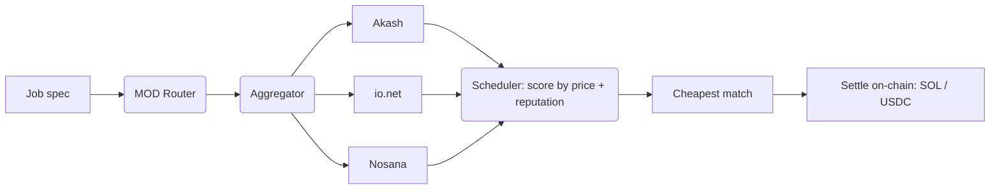

<div align="center">


# MOD DePIN

**Unified routing layer for decentralized GPU compute**

[](LICENSE)
[]()
[]()


</div>

---

## Overview

DePIN GPU markets are fragmented. Akash, io.net, and Nosana list the same cards at different prices, in different regions, with different reliability — and those prices move every minute. Builders end up shopping across dashboards, juggling accounts, and still overpaying.

**MOD DePIN is one endpoint to all of them.** You describe the job; the router queries every connected network in real time, scores each offer by price and reliability, and routes to the cheapest provider that can actually run it. Settlement clears on-chain in SOL or USDC — no accounts, no lock-in, no minimums.

## Why MOD DePIN

- **Best-price routing** — every job lands on the cheapest available provider that meets your spec.
- **One endpoint** — a single API across Akash, io.net, and Nosana instead of three integrations.
- **Live price index** — normalized, real-time pricing and reliability across all networks.
- **On-chain settlement** — pay per job in SOL or USDC; no subscription, no commitment.
- **No lock-in** — an open routing layer where providers compete on every request.

## How it works



1. **Submit** a job spec — GPU model, count, duration.
2. **Aggregate** — connectors pull live offers from every network (cached ~30s).
3. **Score** — offers are ranked by price/hr and provider reputation.
4. **Route** — the cheapest qualifying offer is returned; routes are valid for 5 minutes.
5. **Settle** — payment clears on-chain in SOL or USDC. No subscription, no minimums.

## Supported networks

| Network | Description |
|---------|-------------|
| **Akash** | Decentralized cloud marketplace |
| **io.net** | Aggregated GPU DePIN |
| **Nosana** | Solana-native compute network |

## Supported GPUs

| Tier | GPUs | Typical workload |
|------|------|------------------|
| Datacenter | H100, A100 | Training, large-batch inference |
| Mid-range | L40, A10G | Fine-tuning, serving, rendering |
| Consumer | RTX 4090, RTX 3090, T4 | Inference, dev, small jobs |

Regions: **US · EU · ASIA**

## Install

```bash
npm install @moddepin/sdk      # TypeScript / JavaScript
pip install mod-depin          # Python
cargo add mod-depin            # Rust
```

## Usage

**TypeScript**

```typescript
import { Router } from '@moddepin/sdk';

const router = new Router(process.env.MOD_API_KEY!);
const routes = await router.route({
  gpu: 'H100',
  gpuCount: 1,
  durationHours: 4,
});

console.log(routes[0]);       // cheapest match: provider, price/hr, region, reliability
```

**Python**

```python
from mod_depin import Router

router = Router(os.environ["MOD_API_KEY"])
routes = router.route({
    "gpu": "H100", "gpu_count": 1, "duration_hours": 4,
})
print(routes[0])
```

## API

Every SDK wraps a single REST endpoint.

```http
POST https://api.moddepin.xyz/v1/route
Authorization: Bearer <MOD_API_KEY>
Content-Type: application/json

{ "gpu": "H100", "gpuCount": 1, "durationHours": 4 }
```

```jsonc
// 200 OK — offers sorted cheapest-first
[
  {
    "provider": "akash",
    "gpu": "H100",
    "priceHr": 1.92,        // provider price, USD/hr
    "region": "US",
    "reliability": 93,      // %
    "routeId": "rt_…",
    "expiresIn": 300        // seconds
  }
]
```

## Pricing & settlement

- **Routing fee** — flat **5%** on top of the provider price.
- **Settlement** — on-chain in **SOL** or **USDC**, per job. No subscription, no minimums.

## Repository layout

```
mod-depin/
├── src/
│   ├── router/       # request entry, route selection
│   ├── aggregator/   # pull + normalize offers from each network
│   ├── scheduler/    # score offers by price + reputation
│   ├── config/       # providers, constants, feature flags
│   └── types/        # shared schemas
├── sdk/
│   ├── ts/           # TypeScript client
│   ├── py/           # Python client
│   └── rust/         # Rust client
├── cli/              # command-line interface
├── benches/          # routing benchmarks
└── spec/             # RFC protocol specs
```

## Configuration

Feature flags live in `src/config/constants.ts`:

| Flag | Default | Notes |
|------|---------|-------|
| `ENABLE_REPUTATION_SCORING` | on | Weight offers by provider reputation |
| `ENABLE_ZK_EXPERIMENTAL` | off | Experimental ZK route proofs |
| `ENABLE_ROLLUP_MODE` | off | Batched settlement (planned) |

Other defaults: price cache `30s`, route validity `300s`, max `50` offers/provider.

## Roadmap

- [x] Routing engine across Akash / io.net / Nosana
- [x] Live normalized price + reputation index
- [x] SDKs — TypeScript, Python, Rust + CLI
- [ ] On-chain settlement on testnet
- [ ] Mainnet RC (gated)
- [ ] Batched (rollup) settlement
- [ ] Additional network adapters

## Specs

| RFC | Title | Status |
|-----|-------|--------|
| [RFC-0001](spec/RFC-0001-routing-protocol.md) | Core Routing Protocol | Draft |


## Links

- Website — [moddepin.xyz](https://moddepin.xyz)

## License

Apache 2.0 — see [LICENSE](LICENSE).
